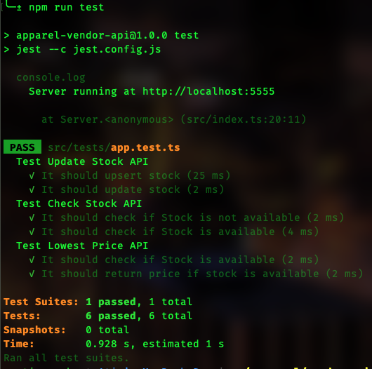

# Local server setup

1. use node 20.11 `nvm use`
1. copy env values `cp example.env .env`
1. package install `npm i`
1. run local server `npm start`
1. <details>
   <summary>Run tests `npm test`</summary>
   
   </details>

# Tech Stack

- Express.js v4
- Typescript v5
- Jest v29

# API definition

Postman collection json is attached with API definition and sample payload for testing.

filepath - `./Vendor API.postman_collection.json`

# Additional API Info

### Update Stock

```cURL
curl --location --request PATCH 'localhost:5555/update-stock' \
--header 'Content-Type: application/json' \
--data '[
    {
        "code": "33",
        "size": "S",
        "quantity": 50,
        "quality": "average",
        "pricePerUnit": 400
    }
]'
```

The `Update Stock API` updates the price and quantity of an existing apparel of code `33`, size `S`, and quality `average`. If the stock doesn't exist, it will add it. Missing sizes quantity will be set to zero i.e. size `M` and `L` quanity will be `0`.

One or multiple stock can be added/updated in single api call.

Success message

```
{
    "message": "Stock updated Successfully"
}
```

### Check Stock

```cURL
curl --location 'localhost:5555/check-stock' \
--header 'Content-Type: application/json' \
--data '[
    {
        "code": "1",
        "sizes": {
            "S": 3,
            "M": 55,
            "L": 2
        },
        "quality": "good"
    },
    {
        "code": "1",
        "sizes": {
            "S": 30,
            "M": 10,
            "L": 2
        },
        "quality": "average"
    }
]'
```

The `Check Stock API` checks if the required quantities for all sizes of a given apparel with mentioned quality is available in stock and if the customer order can be fulfilled.

For sufficient stock

```
{
    "message": "Sufficient stock available"
}
```

For insufficient stock

```
{
    "message": "Insufficient Stock for code: 1, quality: good, size: M"
}
```

### Check Lowest Price

```cURL
curl --location 'localhost:5555/check-lowest-price' \
--header 'Content-Type: application/json' \
--data '[
    {
        "code": "1",
        "sizes": {
            "S": 1,
            "M": 1,
            "L": 1
        }
    },
    {
        "code": "33",
        "sizes": {
            "S": 1,
            "M": 1,
            "L": 1
        }
    }
]'
```

The `Check Lowest Price API` finds the lowest price to fulfill the order, regardless of stock availability. It calculates the price for the given sizes with `average` quality.

If successful, the response will be:

```
{
    "message": "Lowest price to fullfill this order is ₹2290"
}
```

If Stock is missing or price isn't updated

```
{
    "message": "Stock not available, code: 22"
}
```

```
{
    "message": "Price not found, code: 33, quality: average, size: M"
}
```
